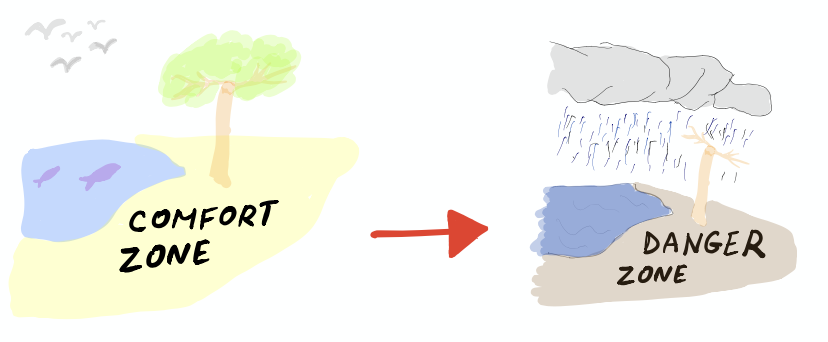

![headline][headline]

 
The end of 2019 is right near the corner, and I thought it would be the right time for me to reflect over my professional progress over the last year.
 
 
### **New Job**

The first major change for me in 2019 was starting a new job.
 In December 2018, after I've left my previous job where I've been working for more than 4 years as a Ruby developer on a social platform,
I was looking for a position that will enforce me to get out of my comfort zone and push me to my limits.
 

Somewhere at 2015, I've read about a relatively new programming-language called Rust developed in Mozilla.
From a first glance, the syntax was a bit awkward and I've chosen not to pursue with researching it.

It wasn't until 2018 that it finally struck me that Rust is not just another new trendy programming-language, but something different, disruptive that must be learned.
I finally understood what the hype was all about, and I really wanted to work with this language sometime.

When I was seeking a now job, I really wanted that position to involve Rust programming, at least to some extent.
Ideally, I wanted a full-time Rust position.
The language has been (and still is) in its early-adopters stage,
so I didn't find any full-time Rust development vacancy in Israel.
Therefore, I've started looking for a Rust remote position.

Unsurprisingly, there were scarcely remote options, but luckily I've stumbled upon a small remote jobs website that had an open position requiring Rust development primarily in NYC.
 
 
The name of the company was [Spacemesh][spacemesh], where I'm working now.
Spacemesh is about building a decentralized programmable cryptocurrency powered by a novel proof-of-space-time, race-free consensus protocol.
 
 
The funny thing is that Spacemesh is actually an Israeli company that looked for remote people too (outside of Israel).

Besides only knowing the very basics of Rust and having no hands-on Rust experience, this position was about developing Smart-Contracts infrastructure.
Meaning, having some compilation knowledge was also required. I did a Compilers course more than 10 years ago when I was a student, but otherwise I didn't have any knowledge whatsoever.
Actually, I had no deep knowledge about Blockchain or Smart-Contracts either.

Obviously, this position seemed like one that will require me to go out of my comfort zone.
In many terms it forced me to do a substantial start over, and that was perfect for me.
Luckily, I got the chance and was hired for this position!

I was ready to embark on this new journey, with much excitement and some fears how things will turn.
 
 

 
 
### **Rust**

2019 was the year I started working as a Rust programmer. Rust is known for having a steep learning curve but in the end of the day, I truly think it does worth it.

What I really liked about Rust was that on one hand Rust is a system programming-language, so it's inclined to serve as an alternative to languages such as C and C++.
But on the other hand Rust, has many high-level abstractions that are typically found at more high-level (non system-programming) languages.

Rust has functional elements in its syntax, support for futures (a.k.a promises in other language), meta-programming, traits, and more.
Not only that but Rust boasts of having many zero cost abstractions with execution times comparable to C and C++.

So Rust is a very versatile language. You can virtually build with it anything. Not only low-level programs
(operating-systems, compilers, databases, games-engines, text-editors etc), but also Web applications, command-line utilities or any script that would otherwise be coded
in python/ruby/shell script.

The other game-changer of Rust is safety. Rust unique ownership model accompanied with awesome compilation error messages brings a lot of confidence to the developer.
It's way more than just developer happiness. It's about developer confidence.

A lot of the pain is taken care of thanks to the Rust compiler.
Many safety (memory-leaks, bad memory access, race-conditions) pitfalls get caught during compilation time.

These days Rust is heavily used in Blockchain projects. New databases are being written in it. Games companies start adopting it and many deep-tech companies
use Rust as a key part of their tech-stack.

Not only that, but whale companies like Amazon, Microsoft, Google, Dropbox and more are betting on Rust. It's seems like a new era.
 
 
### **Compilation**
As part of my job, I've immersed myself in the fascinating world of compilers in general and specifically WebAssembly.
I still have a long way to go, but I did manage to build a very basic programming-language that runs within an interpreter.
[Here is a link to the repository][tytle-repo].

In the last months of this year I've reached the first milestone of SVM, the runtime based on [wasmer][wasmer] that Spacemesh will execute in the future
its Smart-Contracts. More on SVM can be read [here][svm-post].

As a bonus, I've even made some small contributions to [wasmer][wasmer-contrib].
 
 
### **Relearning to type**
I've written about my learning to type in Colemak [in this post][relearning-to-type].
 Apart from the obvious productivity boost of using a more ergonomic keyboard-layout, there is the mental side
of muscle memory rewiring. Taking this challenge was not easy but very rewarding.
 I'd recommend anyone to try out sometime moving to a new keyboard-layout or another challenge
that will make them relearn a daily activity that he/she is doing in an autopilot mode.
 
 
### **Reading code**
I've always loved reading beautiful pieces of code. Learning how other people think, and see how they approach solving a given problem is very educational.

Observing elegant abstractions that simplify problems that seem intractable is a real joy.
This year I've read a lot of Open-Source code. This is undoubtedly something I'd like to continue doing and at greater scale in the future.

Learning from others is a super important for getting better. [Here's a very nice recommended article.][ultralearning-environments]
 
 
### **Working on my English**
This year I've worked hard on my English vocabulary, hoping that having a richer dictionary will give me a boost while working.
 In the last 6 months or so, I've practiced on a daily basis my English using the [Supermemo][supermemo] app (see also: [Spaced Repetition][spaced-repetition]).
 I believe that being articulate is a key requirement that anyone should aim to possess.

First of all, a considerable amount of development-time is about communicating what we did/doing/will be doing.
We write emails, Slack with other people, write comments on PRs and of course we **document our code**.

Being able to deliver you message is critical. Secondly, there's a well known quote saying:

_There are only two hard things in Computer Science: cache invalidation and naming things_
 
_- Phil Karlton_

Naming things right is crucial to writing good code.
 Good code should be explicit and express its intent clearly.
  Without good names for functions/classes/modules/variables, the readability of the code will suffer.
Having a richer vocabulary makes the naming things much more effective.
 
 
### **Speaking**
I've done more than a handful of talks until this year, but I've never had one away from home (not in Israel).
On June, it was my first time speaking aboard. It was a very refreshing experience and hopefully I will have more chances in the future.

The talk was related to my research on the future of Smart Contracts using WebAssembly for Spacemesh. If you're curious [here's the link][svm-talk] to the talk.
 
 
### **Blogging**
Starting my own blog was something I really wanted do for a long time, and I'm really happy I've taken this step.
I wish myself that I'll be able to be persistent and publish occasionally articles people will find useful.
 
 
### **Summary**
That was a very productive year for me. The last time I've had such major career change was around 5 years ago when
migrating from working as a .NET developer (Windows and Visual Studio of course) to a Mac user, programming in Ruby using vim.

Learning is a life-long unbounded journey.
 
I have in my mind where I'd like to move forward next year.
 
 
**I wish you a Happy New and Fulfilling Year!**
 
 
See also:

* [The Importance of Unlearning][the-importance-of-unlearning]
* [Relearning to Type][relearning-to-type]
* [Supermemo: Learn fast and forget about forgetting][supermemo]
* [Ultralearning: Master Hard Skills, Outsmart the Competition, and Accelerate Your Career][ultralearning-book]

[headline]: https://www.incimages.com/uploaded_files/image/970x450/getty_477569935_970656970450085_79639.jpg
[spacemesh]: http://spacemesh.io
[tytle-repo]: https://github.com/spacemeshos/tytle
[svm-post]: https://gryphon.dev/2019/10/06/svm/
[wasmer]: https://wasmer.io/
[wasmer-contrib]: https://github.com/wasmerio/wasmer/commits?author=YaronWittenstein
[supermemo]: https://supermemo.com
[svm-talk]: https://www.youtube.com/watch?v=mcvBXQ0SWJM
[the-importance-of-unlearning]: https://gryphon.dev/2019/06/27/the-importance-of-unlearning/
[relearning-to-type]: https://gryphon.dev/2019/10/04/relearning-to-type/
[ultralearning-environments]:  https://www.scotthyoung.com/blog/2019/01/03/ultralearning-environments/
[ultralearning-book]: https://www.amazon.com/Ultralearning-Master-Outsmart-Competition-Accelerate-ebook/dp/B07K6MF8MD
[spaced-repetition]: https://en.wikipedia.org/wiki/Spaced_repetition
[supermemo]: https://www.supermemo.com/en
