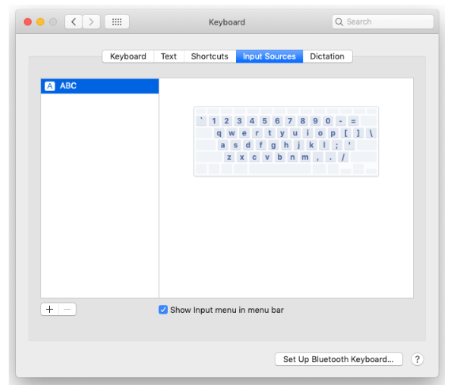
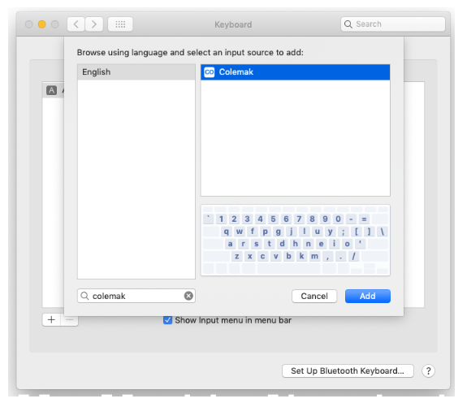
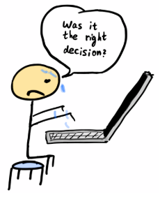

![Headline][Headline]

## Short History

More than 99% of computer users use the QWERTY layout, bud did you know that the QWERTY layout was introduced in 1878?
 
 
Yes, it's not a typo. It's **1878**! The 19th century.
 
Queen Victoria was on the throne (with more than 20 years left).
 
Computers were not in existence yet!
 
People didn't have home electricity!!
 
Man, forget about home-electricity and computers, 
People were still horse-riding since they had no cars.

Look at your shiny QWERTY keyboard lying beneath your hands.
 You are looking at a layout of more than 140 years old!
  
Ever since reading that, I had an image stuck in my head of myself working with my Mac having a 19th-century keyboard layout.
 

There are many stories on the Web around QWERTY being designed to slow down the typists.
The real reason was probably due to mechanical reasons, trying to avoid jams by placing popular English letter pairs as distant QWERTY characters.
Whatever the exact story behind QWERTY is, it's truly remarkable it survived that many years and it's pretty much obvious it's not perfect...
I don't know how to calculate the accumulated worldwide productivity loss here, but it's undoubtedly quite substantial.
  
## Why?

When you QWERTY, do you feel sometimes feelings of discomfort?
 
Do you find your fingers juggling between characters?
 
Do you suffer from some pain after typing a lot? (see [RSI][RSI])
 

I know I did and I didn't like that at all.
 I've always known there were other keyboards layouts alternatives.
 I even knew that the 2nd most popular alternative to QWERTY was [Dvorak][Dvorak].
  However, I just never found a good excuse to try to learn a Dvorak.
Learning Dvorak seemed like the only valid alternative but it seemed an impossible endeavor. The learning curve appeared too steep.
 How could I do that without sacrificing my productivity for months?

In order to go for Dvorak, I had to have a very good incentive that will persuade me.
  That didn't happen. But something else did happen one year ago...
  
## When?

About one year ago I've coincidentally come across a relatively new (invented in 2006 Shai Coleman) keyboard layout called [Colemak][Colemak] which is considered
to be now the 3rd most popular keyboard layout after QWERTY and Dvorak.
  
After doing some research about Colemak it felt like a different story than Dvorak, and the key reason is that
**Colemak has only 17 moved keys in comparison to QWERTY!**

That fact, at least I thought so, meant it will be much easier to learn Colemak.

From Colemak official site:

* _"Your fingers on QWERTY move 2.2x more than on Colemak."_
* _"QWERTY has 16x more same hand row jumping than Colemak."_
* _"There are 35x more words you can type using only the home row on Colemak."_

So I've decided I'd go for it. But I didn't want to go cold-turkey.
 
I wanted a **gradual** process.
 
I couldn't slow down significantly my productivity for months.
  
## How?

The plan I came up with was to practice Colemak a couple of minutes on a daily basis and when I'll feel ready I'll swap.

I've Googled for a Typing Training app coming with Colemak support and found [Type Fu][Type Fu].
I highly recommend this app. I've started working through the lessons.
Each lesson adds a new element to practice, building on top of previous lessons.

After about 9 months, practicing on-and-off it suddenly struck to me that my QWERTY typing started to deteriorate.
The problem was that I wasn't yet fluent with Colemak either. You could imagine how frustrating this can feel.
It's like having a split-brain. But not that kind of split-brain in the context of a [distributed-system][distributed-system-brain-split],
but literally a physical one.

 
When that crisis emerged I was reading half-way through a book called [Ultralearning][Ultralearning Book Site] in my spare time.
This book is thought-provocative regarding how to learn more efficiently in less time. One of the techniques discussed in the book is going cold-turkey
and embracing the accompanying frustrations when facing hurdles.
  
This book definitely gave me sort of confirmation that it's time to discard QWERTY
and start Colemak only. The other option was to give up the Colemak training and to strengthen my QWERTY again. That alternative was out of the question.
  
I knew it's now or never. I've decided I'm all-in.
 
As for the _Ultralearning book_, I won't say more in this post but to encourage you to go and read it!
  

## Making the swap

I'm a Mac user. Surprisingly, macOS comes with Colemak support built-in.
In order to configure Colemak, just go to **System Preferences -> Keyboard**
  

  
Now, click on the **+** button in order to add a new input source and search for Colemak and click on **Add** (as illustrated).
  

  
If you're a Linux user, I've read it has Colemak out of the box too.
 
Windows users should manually download the Colemak keyboard layout. (future Windows versions will probably have Colemak too).
 

So I've set Colemak as my only keyboard for English and embarked on a journey I had no idea what will come out of.
  
### The first two days

The first two days were 100% pure self-torture.
I was hardly able to open a file. Everything I did was sooooo sllooooowwwwww.

I kept saying to myself _"What have I done?"_ or _"Maybe QWERTY isn't that bad after all?"_.
There were even dreadful moments that I had frightening thoughts I'll never be able to do any work ever
(at least not in the pace I was used to).

I admit I've even considered abandoning this and conclude the experiment as a failure
(but at least the patient survived...).

But I'm not the kind of person who gives up so quickly.
I kept reciting in my head the good-old ["Never, never, never give up"][never-give-up] Churchiill's quote.

After each back-down thought, came a new wave of resurgence. I kept saying to myself that I need to stay in the game for at least 3 days.
I had the hope that things will start to flow once my subconscious mind will take charge.
In moments like that, you really appreciate the human brain and the power of our subconscious in our daily habits.

Also, my power brain energy battery depleted very fast, since I had to think about things I was always taking for granted.
So I took many breaks during the workday in order to recharge. After 30 minutes of work, I felt the same as sweating after a gym workout.

 

  

### The third day

On the third day, things finally started to click. I was much more capable of working. I didn't feel lost as I did in the first 2 days, but I still
had to exert a lot of mental energy in order to type. On one hand I was half-optimistic but on the other hand, I was also half-worried about this adventure.
I kept praying I'll be able to ride out these days.

One of the shocking things I came to understand when transitioning to Colemak was that our subconscious stores many-many different neurons pathways
besides "_where letter **X** is located ?_" on the layout.
  
It means that I can blindly type each alphabetical letter, but when trying to type a pair of letters one
after the other my hands sometimes auto-magically located themselves as-if back to QWERTY.
 It made me understand that I need also to practice letter tuples specifically.

  

### The first two weeks

I've managed to keep it on. Day after day, it became easier to adapt to Colemak and my confidence increased.
Each day I got better. My subconscious has taken control of my typing back again.
I was much less frustrated and exhausted. I knew it was only a matter of days until I'll stop thinking about my typing at all.
  

  
### The first month

Now I'm about a month since making this big move. I have undertaken a challenge I was very concerned about its outcome.
Happily, I call it a success now. I feel much more enjoyable while I type.
My hands don't move so much as in QWERTY and the typing is effortless as expected.
I still have some specific elements to perfect, but overall I feel happy with the way I type right now.

Additionally, I keep practicing [Type Fu][Type Fu] and I'm also able to type in the range of 50-70 words-per-minute on [typeracer][typeracer].
  
_typeracer_ throws at you different texts to type each session, so it's a more accurate benchmark than _Type Fu_ which I consider great
for practicing subsets of the Colemak layout. Part of the practicing I emphasize typing at the fastest pace I can,
and others on doing typing slower but trying to avoid mistakes as much as possible.

  

## What about vim?

If you're not a vim user, please feel free to skip to the next paragraph, **"Was it worth it?"**
  
Being a vim user didn't help me. Similarly, to the neurons pathways for pairs of letters I've described above, I've found my muscle memory had many
vim specific pathways I'll have to reconstruct.

For example, copying the current word in vim normal mode is **yw**. My brain had a pathway just for that. My hands knew what to go when I want
to copy a word. But now, **y** has moved to another position. I had to rewire the **yw** muscle memory.
  
Some people edit their vim settings with many Colemak definitions to ease the move to Colemak.
I've decided I don't want to do that. I wanted to keep thinking about the mnemonics commands of vim.
The only change to my vim config was remapping the letter **n** to **j** when in normal and visual modes. (QWERTY letter **j** is remapped to letter **n** in Colemak).
Thad made my life much easier when navigating.
  
## Was it worth it?

In one word YES!
 
in two words: FUCKING YES!

QWERTY typing never felt elegant for me. If always felt like something just isn't right.
Typing is supposed to be fun, and with Colemak it's much more fun.
The motivation wasn't to type faster than QWERTY but to make typing more fun and less effortless.
  
I may type faster now than I did with Colemak, and even if not it will happen in the future as one of the side-effects of using Colemak.

Learning Colemak reminds me of the feelings I had when picking up vim. vim as Colemak, had a steep learning curve, but once,
I've overcome the initial bump, it was a huge productivity boost.
  
Besides that, relearning to type is a very rewarding challenge. It requires you to [unlearn][The Importance of Unlearning]
the way you're used to typing.
  
Rewiring that part of the brain was nerve-wracking, frustrating, exhausting but eventually totally worth it.
Our brain is flexible and has amazing abilities to adapt to changes. I really think that anyone should pick once in a while some
challenges that will force their brain to stretch and transform.
  
If you suffer from [RSI][RSI], or looking for QWERTY alternatives you should consider [Colemak][Colemak]

 

## References
* [Colemak][Colemak]
* [QWERTY][QWERTY]
* [RSI][RSI]
* [The Importance of Unlearning][The Importance of Unlearning]
* [Ultralearning Book][Ultralearning Book Site]
* [Type Fu][Type Fu]
* [typeracer][typeracer]

[Headline]: https://www.typingclub.com/m/pub/images/tpc-right-left.png
[QWERTY]: https://en.wikipedia.org/wiki/QWERTY
[Dvorak]: https://en.wikipedia.org/wiki/Dvorak_Simplified_Keyboard
[RSI]: https://en.wikipedia.org/wiki/Repetitive_strain_injury
[distributed-system-brain-split]: https://en.wikipedia.org/wiki/Split-brain_(computing)
[never-give-up]: https://www.brainyquote.com/quotes/winston_churchill_143691
[Type Fu]: https://type-fu.com/
[Ultralearning Book Site]: https://www.scotthyoung.com/blog/ultralearning/
[typeracer]: https://play.typeracer.com/
[Colemak]: https://colemak.com/
[The Importance of Unlearning]: https://gryphon.dev/2019/06/27/the-importance-of-unlearning/
